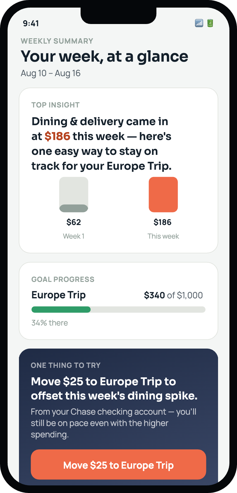

# Quarterly Review — Weekly Summary Narrative Structure

6-slide deck for Marcus, plus a fallback single-slide summary. Backbone: `docs/recommendation-memo.md` and `data/metric-findings.md`. Framing calibrated to `stakeholders/marcus.md` — recommendation stated first, one page of density per slide, a specific ask with a path to a deadline, honest about what's proven vs. not.

**Built as an interactive artifact:** [Four Points to Marcus](https://claude.ai/code/artifact/e77f53b2-cf74-4d7d-a98d-e5532c87b85a) (private by default) — a pixel-art game-styled version of this exact structure and data. Speaker notes: `docs/presentation-notes.md`.

---

## Slide 1 — The Problem

**Headline:** 30-day retention dropped from **44% → 37%** over the last two quarters.

**The one insight:** Users get an initial "aha" from the spending breakdown, then the app gives them nothing further to act on. *(`docs/decision-brief.md`, `strategy.md`)*

---

## Slide 2 — Why Now

**What changed:** We ran a real, controlled pilot — the first real quantitative data this project has had. *(`data/metric-findings.md`)*

**What we learned:**
- Day-7 retention: 76% vs. 46% control — **statistically significant** (p=0.002)
- Open rate: 28–56% vs. 4–6% control, holds across all 4 sends — significant (p<0.0001)
- Day-30 retention: 36% vs. 22% control — large, but **not yet statistically significant** (p=0.123)

*(all: `data/metric-findings.md`, `docs/recommendation-memo.md`)*

---

## Slide 3 — The Proposal

**What it is:** Expand the pilot to a properly powered sample — **1,158 users/arm** — before any full-rollout decision. *(`data/experiment-design.md`)*

**What it isn't:**
- Not a full rollout — the day-30 lift isn't proven yet
- Not a commitment to the debt-aware nudge (H2) — explicitly out of scope, 25% confidence *(`docs/hypothesis.md`, `docs/spec-readiness.md`)*

---

## Slide 4 — Evidence

**What it looks like:**

*(`prototype/screenshots/round4-02-summary.png` — base flow; two further refinements, a transaction drill-down and an ordinary-week state, shipped after this screenshot, see `docs/prd.md`)*

**What users told us (real interviews, not simulated):**
> "I kept waiting for it to give me something to act on and it never really did." — Tom R. *(`research/interview-synthesis.md`)*

> "I have been waiting for Nudge to tell me the next step." — Amara L. *(`research/interview-synthesis.md`)*

**What the data shows:** Day-7 retention and open rate are both statistically significant, not just directionally positive. *(`data/metric-findings.md`)*

---

## Slide 5 — The Plan

**Timeline:** ~5–7 weeks to reach 1,158/arm — fits an 8-week max. Exact date pending confirmation of real weekly enrollment pace with data/eng. *(`data/experiment-design.md`)*

**Milestones — 3 leading indicators, monitored weekly (not waiting 8 weeks blind):**
1. Day-7 retention, by cohort
2. Weekly summary open rate, by cohort
3. Action-rate-vs-retention relationship (the H2 diagnostic)

*(`data/experiment-design.md`)*

**Risks:**
- **If we wait:** retention keeps declining on the documented pattern (32%→22% across cohorts 1–4). *(`data/experiment-design.md`)*
- **If we scale now:** we commit effort on a result with a real (~1-in-8) chance of being noise. *(`data/experiment-design.md`)*

---

## Slide 6 — The Ask

1. **Sign-off to extend the experiment** to the properly powered sample (1,158/arm) before any full-rollout decision. *(`docs/recommendation-memo.md`)*
2. **Sign-off on the success-metric change:** day-7 retention as primary (day-30 once powered), action rate demoted to diagnostic-only — users who act currently retain *worse* (31.0%) than users who open but don't act (42.1%). *(`data/metric-diagnosis.md`, `docs/recommendation-memo.md`)*
3. **A specific rollout date follows once weekly enrollment pace is confirmed** with data/eng — this is the input needed to close the timeline question. *(`stakeholders/marcus.md`)*

---

## Slide 7 — One-Slide Fallback

**If only one slide survives:** 30-day retention fell 44%→37%. A real pilot showed a statistically significant day-7 lift and a promising-but-unproven day-30 lift. The ask: approve expanding to a properly powered test (~5–7 weeks) before committing to a full rollout.
